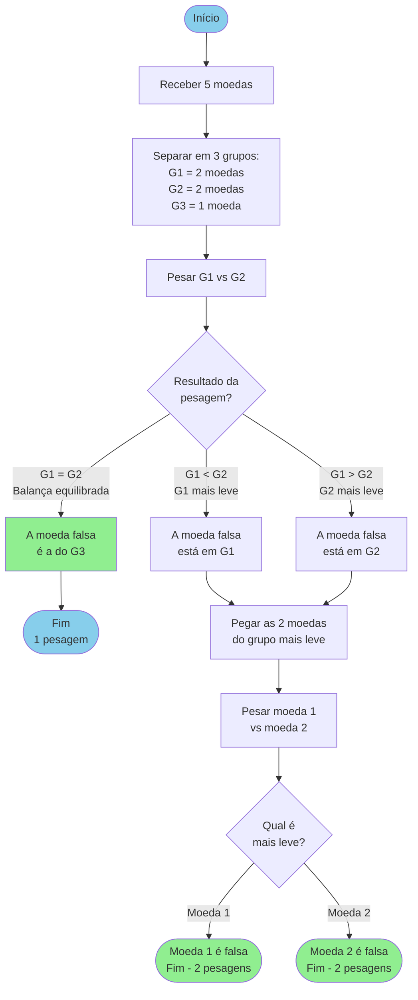

# Capítulo 1 - Exercício 01: Moeda Falsa

> **Livro:** Algoritmos e Lógica da Programação, Marco A. Furlan de Souza.
> **Capítulo:** 1 - Introdução

---

## 📝 Enunciado

Descreva como descobrir a moeda falsa em um grupo de cinco moedas, fazendo uso de uma balança analítica (sabe-se que a moeda falsa é mais leve que as outras), com o menor número de pesagens possível. Lembre-se de que sua descrição deve resolver o problema para qualquer situação.
_Dica: É possível resolver com apenas duas pesagens._

---

## 💭 Análise do Problema

**Entrada:**

- Conjunto de 5 moedas.

**Processamento:**

- Dividir as moedas em 3 grupos o mais equilibrado possível.
- Identificar o grupo que contém a moeda falsa.

**Saída:**

- Identificação da moeda falsa.
- Número de pesagens realizadas.

---

## 📊 Fluxograma (Mermaid)



---

## 📝 Pseudocódigo

```
Algoritmo: Encontrar_Moeda_Falsa

Início
    // Entrada
    moedas ← 5 moedas (uma delas é falsa e mais leve)
    pesagens ← 0

    // Primeira divisão
    grupo1 ← moedas 1 e 2
    grupo2 ← moedas 3 e 4
    grupo3 ← moeda 5

    // Primeira pesagem
    pesagens ← pesagens + 1
    Pesar grupo1 contra grupo2

    Se grupo1 = grupo2 então
        moeda_falsa ← grupo3
        Mostrar "A moeda falsa é a", moeda_falsa
        Mostrar "Total de pesagens:", pesagens

    Senão se grupo1 < grupo2 então
        moedas_suspeitas ← grupo1

        // Segunda pesagem
        pesagens ← pesagens + 1
        Pesar moeda 1 contra moeda 2 do grupo1

        Se moeda1 < moeda2 então
            moeda_falsa ← moeda 1
        Senão
            moeda_falsa ← moeda 2
        Fim se

        Mostrar "A moeda falsa é a", moeda_falsa
        Mostrar "Total de pesagens:", pesagens

    Senão // grupo2 < grupo1
        moedas_suspeitas ← grupo2

        // Segunda pesagem
        pesagens ← pesagens + 1
        Pesar moeda 3 contra moeda 4 do grupo2

        Se moeda3 < moeda4 então
            moeda_falsa ← moeda 3
        Senão
            moeda_falsa ← moeda 4
        Fim se

        Mostrar "A moeda falsa é a", moeda_falsa
        Mostrar "Total de pesagens:", pesagens

    Fim se
Fim
```

## 💡 Observações

---

## 🔗 Links Relacionados

- [Resumo do Capítulo 1](../../../../docs/resumos/furlan-logica.md#capítulo-1)
- [Próximo exercício: Cap01_Ex02.md](Cap01_Ex02.md)
