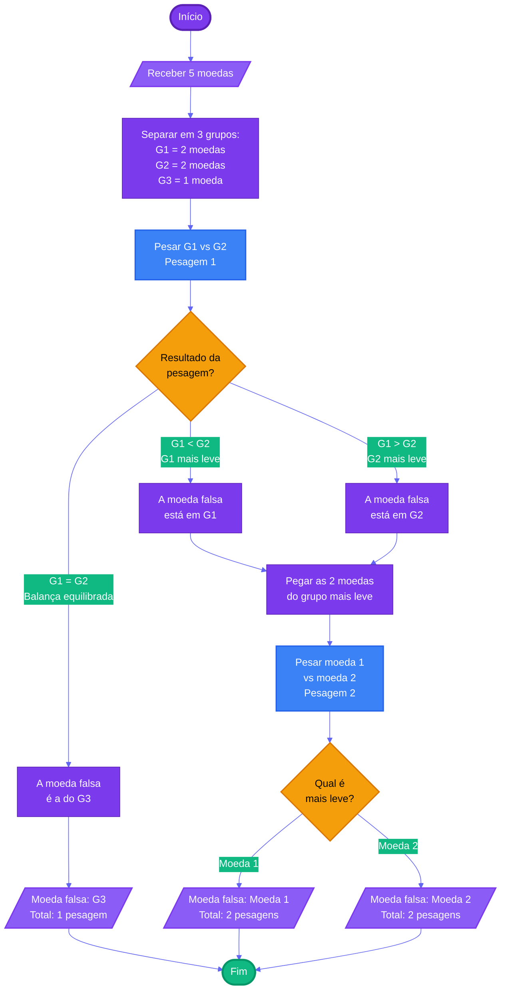

# Capítulo 1 - Exercício 01: Moeda Falsa

> **Livro:** Algoritmos e Lógica da Programação, Marco A. Furlan de Souza  
> **Capítulo:** 1 - Introdução

---

## 📝 Enunciado

Descreva como descobrir a moeda falsa em um grupo de cinco moedas, fazendo uso de uma balança analítica (sabe-se que a moeda falsa é mais leve que as outras), com o menor número de pesagens possível. Lembre-se de que sua descrição deve resolver o problema para qualquer situação.

**💡 Dica:** É possível resolver com apenas duas pesagens.

---

## 💭 Análise do Problema

### Entrada

- Conjunto de 5 moedas (1 falsa mais leve, 4 verdadeiras)

### Processamento

1. Dividir as moedas em 3 grupos: G1 (2 moedas), G2 (2 moedas), G3 (1 moeda)
2. Realizar primeira pesagem comparando G1 vs G2
3. Identificar o grupo que contém a moeda falsa
4. Se necessário, realizar segunda pesagem entre as moedas do grupo suspeito

### Saída

- Identificação da moeda falsa
- Número de pesagens realizadas (máximo: 2)

---

## 📊 Fluxograma

---

## 📝 Pseudocódigo

### Início do Algoritmo

**Passo 1:** Definir 5 moedas com seus pesos

- Moedas verdadeiras: peso = 10
- Moeda falsa: peso = 9

**Passo 2:** Inicializar contador de pesagens = 0

**Passo 3:** Primeira pesagem

- Pesar conjunto (moeda1 + moeda2) vs conjunto (moeda3 + moeda4)
- Incrementar contador de pesagens

**Passo 4:** Verificar resultado da primeira pesagem

#### **Caso 1:** Balança equilibrada (moeda1 + moeda2 = moeda3 + moeda4)

- A moeda falsa é a moeda5
- Exibir: "A moeda falsa é a moeda 5"
- Ir para o Passo 5

#### **Caso 2:** Lado esquerdo mais leve (moeda1 + moeda2 < moeda3 + moeda4)

- A moeda falsa está entre moeda1 e moeda2
- **Segunda pesagem:** Comparar moeda1 vs moeda2
- Incrementar contador de pesagens
- **Se** moeda1 < moeda2 **então**
  - Exibir: "A moeda falsa é a moeda 1"
- **Senão**
  - Exibir: "A moeda falsa é a moeda 2"
- Ir para o Passo 5

#### **Caso 3:** Lado direito mais leve (moeda1 + moeda2 > moeda3 + moeda4)

- A moeda falsa está entre moeda3 e moeda4
- **Segunda pesagem:** Comparar moeda3 vs moeda4
- Incrementar contador de pesagens
- **Se** moeda3 < moeda4 **então**
  - Exibir: "A moeda falsa é a moeda 3"
- **Senão**
  - Exibir: "A moeda falsa é a moeda 4"
- Ir para o Passo 5

**Passo 5:** Exibir total de pesagens realizadas

### Fim do Algoritmo

---

## 💡 Observações

Para encontrar 1 moeda falsa entre **n** moedas com o **número mínimo de pesagens**, utilizamos a fórmula:

$$\text{Pesagens Mínimas} = \lceil \log_3(n) \rceil$$

**Explicação:**

- Cada pesagem em uma balança de dois pratos divide o problema em **3 casos possíveis**: lado esquerdo mais leve, lado direito mais leve ou balança equilibrada
- Por isso a base é 3 (ternária)
- O símbolo ⌈ ⌉ representa o arredondamento para cima (teto/ceiling)

**Para o exercício atual (n=5):**

- Pesagens mínimas = ⌈log₃(5)⌉ = ⌈1.465⌉ = **2 pesagens** ✓

### Tabela de Pesagens Mínimas

| Quantidade de Moedas | Cálculo    | Pesagens Mínimas |
| :------------------: | :--------- | :--------------: |
|          3           | ⌈log₃(3)⌉  |      **1**       |
|          4           | ⌈log₃(4)⌉  |      **2**       |
|          5           | ⌈log₃(5)⌉  |      **2**       |
|          6           | ⌈log₃(6)⌉  |      **2**       |
|          7           | ⌈log₃(7)⌉  |      **2**       |
|          8           | ⌈log₃(8)⌉  |      **2**       |
|          9           | ⌈log₃(9)⌉  |      **2**       |
|          10          | ⌈log₃(10)⌉ |      **3**       |

**Observação:** Com 1 pesagem conseguimos distinguir até 3 moedas. Com 2 pesagens conseguimos até 9 moedas. Com 3 pesagens conseguimos até 27 moedas, e assim sucessivamente.

---

## 🔗 Links Relacionados

- [Resumo do Capítulo 1](../../../../docs/resumos/furlan-logica.md#capítulo-1)
- [Próximo exercício: Cap01_Ex05.md](Cap01_Ex05.md)
