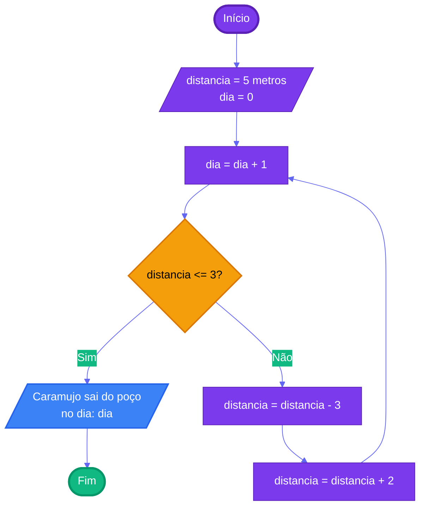

# Capítulo 1 - Exercício 05: Caramujo

> **Livro:** Algoritmos e Lógica da Programação, Marco A. Furlan de Souza  
> **Capítulo:** 1 - Introdução

---

## 📝 Enunciado

Um caramujo está na parede de um poço a cinco metros de sua borda. Tentando sair do poço, ele sobe três metros durante o dia, porém desce escorregando dois metros durante a noite. Quantos dias levará para o caramujo conseguir sair do poço?

---

## 💭 Análise do Problema

### Entrada

- Distância inicial até a borda: 5 metros
- Subida diária: 3 metros
- Descida noturna: 2 metros

### Processamento

1. Inicializar a distância até a borda (5 metros)
2. Inicializar contador de dias (0)
3. A cada dia:
   - Incrementar o contador de dias
   - Verificar se ao subir 3 metros o caramujo alcança ou ultrapassa a borda
   - **Se sim:** O caramujo sai do poço (fim do processo)
   - **Se não:** Aplicar a subida de 3 metros e a descida de 2 metros (saldo de 1 metro por ciclo)
4. Repetir até o caramujo sair

### Saída

- Número de dias necessários para sair do poço: **3 dias**

---

## 📊 Fluxograma

---

## 📝 Pseudocódigo

### Início do Algoritmo

**Passo 1:** Definir variáveis iniciais

- distancia_ate_borda = 5 metros
- subida_diaria = 3 metros
- descida_noturna = 2 metros
- dia = 0

**Passo 2:** Repetir enquanto o caramujo não sair do poço

**Passo 2.1:** Incrementar o dia

- dia = dia + 1

**Passo 2.2:** Verificar se o caramujo consegue sair ao subir durante o dia

- **Se** distancia_ate_borda <= subida_diaria **então**
  - Exibir: "O caramujo subiu 3 metros e saiu do poço!"
  - Exibir: "Total de dias: ", dia
  - Ir para Passo 3 (Fim)

**Passo 2.3:** Se ainda não saiu, processar o ciclo completo (dia + noite)

- **Senão**
  - Durante o dia: distancia_ate_borda = distancia_ate_borda - subida_diaria
  - Durante a noite: distancia_ate_borda = distancia_ate_borda + descida_noturna
  - Exibir: "Dia ", dia, ": Saldo = subiu 1 metro. Faltam ", distancia_ate_borda, " metros"
  - Voltar para Passo 2.1

**Passo 3:** Fim do Algoritmo

---

## 💡 Observações

|  Dia  | Início do Dia | Sobe 3m |     Posição     |   Situação   | Desce 2m | Fim da Noite |
| :---: | :-----------: | :-----: | :-------------: | :----------: | :------: | :----------: |
| **1** |  5m da borda  | ⬆️ +3m  |   2m da borda   | Ainda dentro |  ⬇️ -2m  | 4m da borda  |
| **2** |  4m da borda  | ⬆️ +3m  |   1m da borda   | Ainda dentro |  ⬇️ -2m  | 3m da borda  |
| **3** |  3m da borda  | ⬆️ +3m  | **0m - BORDA!** | **SAIU! 🎉** |    -     |      -       |

**Resultado:** O caramujo sai no **dia 3**.

### 📐 Generalizando o Problema

Para um poço de altura **H**, com subida **S** e descida **D** (onde S > D):

**Fórmula:**

$$
\text{Dias} = \begin{cases}
1 & \text{se } H \leq S \\
\left\lceil \frac{H - S}{S - D} \right\rceil + 1 & \text{se } H > S
\end{cases}
$$

**Aplicando ao nosso caso (H=5, S=3, D=2):**

- Como H > S (5 > 3), usamos a segunda fórmula
- Dias = ⌈(5 - 3) / (3 - 2)⌉ + 1
- Dias = ⌈2 / 1⌉ + 1
- Dias = 2 + 1 = **3 dias** ✓

**Explicação da fórmula:**

- **(H - S):** distância que precisa percorrer antes do último dia
- **(S - D):** saldo líquido por ciclo completo (dia + noite)
- **⌈ ⌉:** arredonda para cima (teto/ceiling)
- **+ 1:** adiciona o último dia (quando finalmente sai)

### 🧮 Exemplos com Diferentes Alturas

| Altura do Poço | Subida | Descida | Cálculo                    | Dias  |
| :------------: | :----: | :-----: | :------------------------- | :---: |
|       3m       |   3m   |   2m    | Sai no primeiro dia        | **1** |
|       4m       |   3m   |   2m    | ⌈(4-3)/(3-2)⌉ + 1 = 1 + 1  | **2** |
|       5m       |   3m   |   2m    | ⌈(5-3)/(3-2)⌉ + 1 = 2 + 1  | **3** |
|       6m       |   3m   |   2m    | ⌈(6-3)/(3-2)⌉ + 1 = 3 + 1  | **4** |
|      10m       |   3m   |   2m    | ⌈(10-3)/(3-2)⌉ + 1 = 7 + 1 | **8** |

---

## 🔗 Links Relacionados

- [Resumo do Capítulo 1](../../../../docs/resumos/furlan-logica.md#capítulo-1)
- [Exercício Anterior: Cap01_Ex04.md](Cap01_Ex04.md)
- [Próximo exercício: Cap01_Ex06.md](Cap01_Ex06.md)

---
