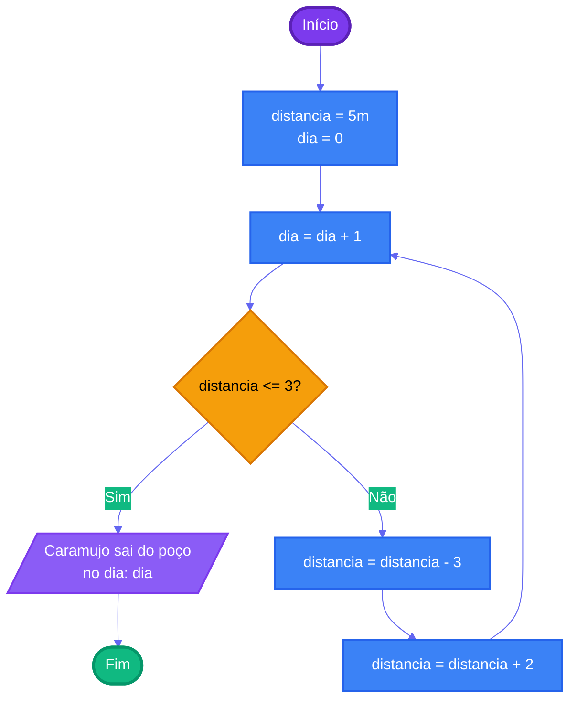

# Capítulo 1 - Exercício 05: Caramujo

> **Livro:** Algoritmos e Lógica da Programação, Marco A. Furlan de Souza  
> **Capítulo:** 1 - Introdução

---

## 📝 Enunciado

Um caramujo está na parede de um poço a cinco metros de sua borda. Tentando sair do poço, ele sobe três metros durante o dia, porém desce escorregando dois metros durante a noite. Quantos dias levará para o caramujo conseguir sair do poço?

---

## 📊 Fluxograma

---

## 🔗 Links Relacionados

- [Código Java](Cap01_Ex05.java)
- [Resumo do Capítulo 1](../../../../docs/resumos/furlan-logica.md#capítulo-1)
