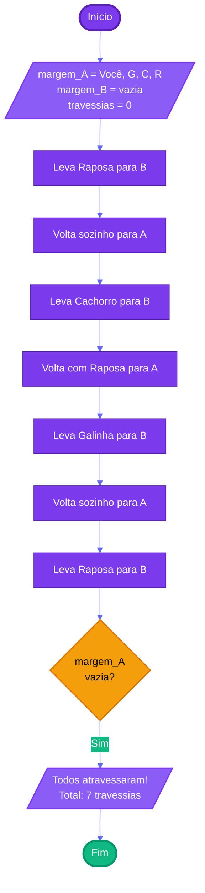

# Capítulo 1 - Exercício 07: Travessia do Rio

> **Livro:** Algoritmos e Lógica da Programação, Marco A. Furlan de Souza  
> **Capítulo:** 1 - Introdução

---

## 📝 Enunciado

Você está em uma margem de um rio, com três animais: uma galinha, um cachorro e uma raposa. Somente pode atravessar com um animal por vez e nunca deixar a raposa e o cachorro sozinhos nem a raposa e a galinha. Descreva uma forma de conseguir atravessar os três animais, obedecendo a essas condições.

---

## 💭 Análise do Problema

### Entrada

- Posição inicial: Você e os 3 animais (galinha, cachorro, raposa) na margem A
- Capacidade do barco: 1 pessoa + 1 animal por vez
- Restrições:
  - ❌ Raposa + Cachorro sozinhos (raposa ataca cachorro)
  - ❌ Raposa + Galinha sozinhas (raposa come galinha)
  - ✅ Cachorro + Galinha sozinhos (sem problema)

### Processamento

1. Levar a raposa primeiro (deixa galinha e cachorro juntos - permitido)
2. Voltar sozinho
3. Levar o cachorro (ou a galinha)
4. Voltar com a raposa (evita conflito na margem B)
5. Trocar a raposa pelo animal que ficou
6. Voltar sozinho
7. Buscar a raposa por último

### Saída

- Todos os animais atravessados para a margem B
- Número total de travessias: **7 movimentos**

---

## 📊 Fluxograma

---

## 📝 Pseudocódigo

### Início do Algoritmo

**Passo 1:** Definir estado inicial

- margem_A = [Você, Galinha, Cachorro, Raposa]
- margem_B = []
- travessias = 0

**Passo 2:** Primeira travessia (A → B)

- Levar: Raposa
- travessias = 1
- margem_A = [Galinha, Cachorro]
- margem_B = [Você, Raposa]
- Exibir: "Travessia 1: Levou a raposa para B"

**Passo 3:** Segunda travessia (B → A)

- Voltar: Sozinho
- travessias = 2
- margem_A = [Você, Galinha, Cachorro]
- margem_B = [Raposa]
- Exibir: "Travessia 2: Voltou sozinho para A"

**Passo 4:** Terceira travessia (A → B)

- Levar: Cachorro
- travessias = 3
- margem_A = [Galinha]
- margem_B = [Você, Raposa, Cachorro]
- Exibir: "Travessia 3: Levou o cachorro para B"

**Passo 5:** Quarta travessia (B → A)

- Voltar: Com Raposa
- travessias = 4
- margem_A = [Você, Galinha, Raposa]
- margem_B = [Cachorro]
- Exibir: "Travessia 4: Voltou com a raposa para A"

**Passo 6:** Quinta travessia (A → B)

- Levar: Galinha
- travessias = 5
- margem_A = [Raposa]
- margem_B = [Você, Cachorro, Galinha]
- Exibir: "Travessia 5: Levou a galinha para B"

**Passo 7:** Sexta travessia (B → A)

- Voltar: Sozinho
- travessias = 6
- margem_A = [Você, Raposa]
- margem_B = [Cachorro, Galinha]
- Exibir: "Travessia 6: Voltou sozinho para A"

**Passo 8:** Sétima travessia (A → B)

- Levar: Raposa
- travessias = 7
- margem_A = []
- margem_B = [Você, Galinha, Cachorro, Raposa]
- Exibir: "Travessia 7: Levou a raposa para B"

**Passo 9:** Verificar conclusão

- **Se** margem_A está vazia **então**
  - Exibir: "Todos atravessaram com sucesso!"
  - Exibir: "Total de travessias: ", travessias

**Passo 10:** Fim do Algoritmo

---

## 💡 Observações

|  Travessia  | Direção |     Leva     | Margem A (após) | Margem B (após) |   Válido?   |
| :---------: | :-----: | :----------: | :-------------: | :-------------: | :---------: |
| **Inicial** |    -    |      -       |  Você, G, C, R  |        -        |     ✅      |
|    **1**    |  A → B  |  **Raposa**  |      G, C       |     Você, R     |     ✅      |
|    **2**    |  B → A  |   Sozinho    |   Você, G, C    |        R        |     ✅      |
|    **3**    |  A → B  | **Cachorro** |        G        |   Você, R, C    |     ❌      |
|    **4**    |  B → A  |  **Raposa**  |   Você, G, R    |        C        |     ✅      |
|    **5**    |  A → B  | **Galinha**  |        R        |   Você, C, G    |     ✅      |
|    **6**    |  B → A  |   Sozinho    |     Você, R     |      C, G       |     ✅      |
|    **7**    |  A → B  |  **Raposa**  |      vazia      |  Você, G, C, R  | ✅ **FIM!** |

**Legenda:** G = Galinha | C = Cachorro | R = Raposa

**Observação na Travessia 3:** Quando levamos o cachorro, ficam raposa e cachorro juntos na margem B (❌ não permitido), **mas é por isso que na travessia 4 voltamos com a raposa!** Esse é o truque da solução.

### 📐 Generalizando o Problema

Este é um problema clássico de **restrições lógicas**.

**Número mínimo de travessias:**

- 3 animais para atravessar
- Você precisa fazer: 4 idas + 3 voltas = **7 travessias**

**Fórmula geral para n animais com restrições similares:**

$$
\text{Travessias} = 2n + 1
$$

**Aplicando ao nosso caso (n=3):**

- Travessias = 2(3) + 1 = **7 travessias** ✓

---

## 🔗 Links Relacionados

- [Resumo do Capítulo 1](../../../../docs/resumos/furlan-logica.md#capítulo-1)
- [Exercício Anterior: Cap01_Ex05.md](Cap01_Ex05.md)
- [Próximo exercício: Cap01_Ex11.md](Cap01_Ex11.md)

---
