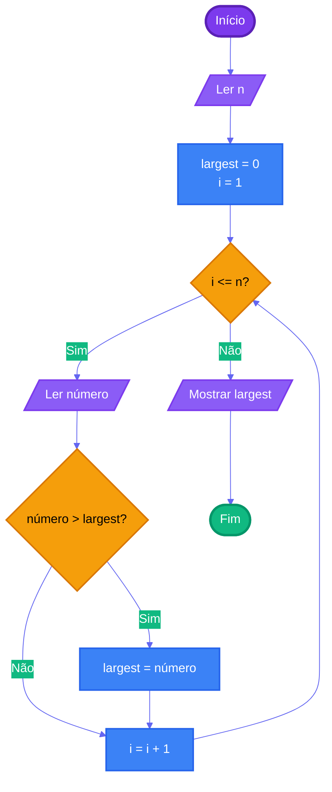

# Capítulo 3 - Exercício 11: Maior de N Valores

> **Livro:** Algoritmos E Lógica Da Programação  
> **Capítulo:** 3 - Algoritmos e a suas Representações

---

## 📝 Enunciado

Elabore um fluxograma que permita a entrada de n (lido pelo teclado) valores reais e apresente como resultado o maior entre esses valores.

---

## 📊 Fluxograma

---

## 🔗 Links Relacionados

- [⬅️ Anterior: Cap01_Ex07](../Cap01_Ex07/flowchart.md)
- [📝 Código Java](Cap03_Ex11.java)
- [➡️ Próximo: Cap03_Ex17](../Cap03_Ex17/flowchart.md)
- [📚 Resumo do Capítulo 3](../../../../docs/resumos/furlan-logica.md#capítulo-3)
