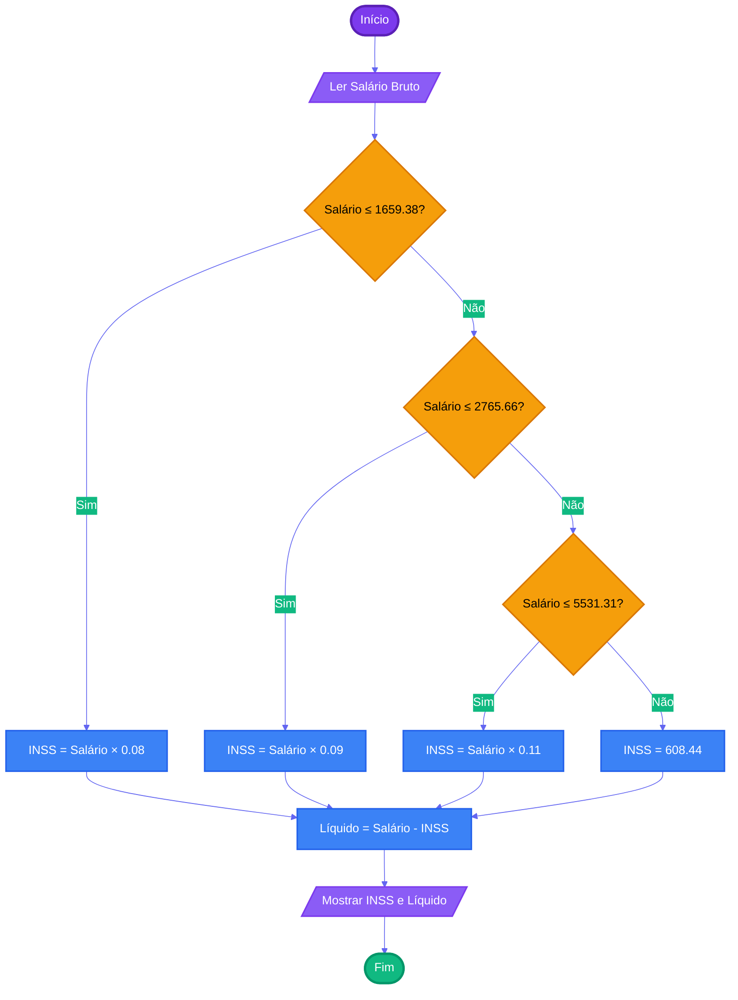

# Capítulo 3 - Exercício 17: Cálculo de Contribuição INSS

> **Livro:** Algoritmos e Lógica da Programação, Marco A. Furlan de Souza  
> **Capítulo:** 3 - Algoritmos e Fluxogramas

---

## 📝 Enunciado

A contribuição para o INSS é calculada de forma progressiva com base no salário bruto, conforme a tabela:

| Salário de Contribuição em R$ | Alíquota (%) |
| ----------------------------- | ------------ |
| Até R$ 1.659,38               | 8%           |
| De R$ 1.659,39 a R$ 2.765,66  | 9%           |
| De R$ 2.765,67 a R$ 5.531,31  | 11%          |
| Acima de R$ 5.531,31          | R$ 608,44    |

Elabore um algoritmo que, para uma entrada do salário bruto, calcule a contribuição ao INSS e o salário líquido restante.

---

## 📊 Fluxograma

---
## 🔗 Links Relacionados
- [Resumo do Capítulo 3](../../../../docs/resumos/furlan-logica.md#capítulo-3)
- [Exercício Anterior: Cap03_Ex11.md](Cap03_Ex11.md)
- [Próximo exercício: Cap03_Ex18.md](Cap03_Ex18.md)

