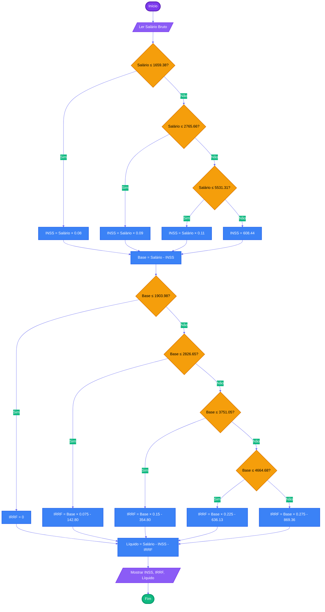

# Capítulo 3 - Exercício 18: Cálculo de Desconto IRRF

> **Livro:** Algoritmos e Lógica da Programação, Marco A. Furlan de Souza  
> **Capítulo:** 3 - Algoritmos e Fluxogramas

---

## 📝 Enunciado

O desconto do IRRF (Imposto de Renda Retido na Fonte), também denominado "Mordida do Leão", é calculado sobre o salário líquido após a dedução da contribuição ao INSS, de acordo com a seguinte tabela:

| Base de cálculo em R$        | Alíquota (%) | Parcela a deduzir em R$ |
| ---------------------------- | ------------ | ----------------------- |
| Até R$ 1.903,98              | Isento       | -                       |
| De R$ 1.903,99 a R$ 2.826,65 | 7,5%         | R$ 142,80               |
| De R$ 2.826,66 a R$ 3.751,05 | 15%          | R$ 354,80               |
| De R$ 3.751,06 a R$ 4.664,68 | 22,5%        | R$ 636,13               |
| Acima de R$ 4.664,68         | 27,5%        | R$ 869,36               |

**Fórmulas:**

- Base de cálculo do IRRF = Salário bruto - Contribuição INSS
- Desconto IRRF = (Base de cálculo × Alíquota) - Parcela a deduzir
- Salário líquido = Salário bruto - Contribuição INSS - Desconto IRRF

Elabore um fluxograma e um algoritmo que, dada uma entrada do salário bruto, calcule a contribuição ao INSS (conforme exercício anterior), o desconto do IRRF e o salário líquido final.

---

## 📊 Fluxograma

---

## 🔗 Links Relacionados

- [Código Java](Cap03_Ex18.java)
- [Resumo do Capítulo 3](../../../../docs/resumos/furlan-logica.md#capítulo-3)
