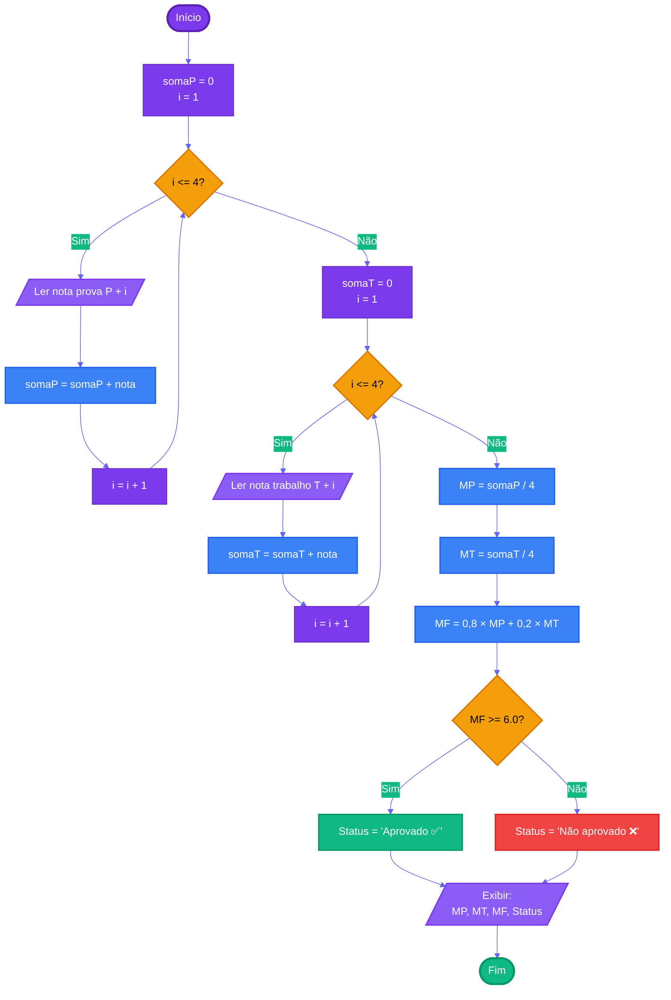

# Capítulo 3 - Exercício 19: Aprovação de Aluno

> **Livro:** Algoritmos E Lógica Da Programação  
> **Capítulo:** 3 - Algoritmos e a suas Representações

---

## 📝 Enunciado

Elabore um fluxograma e um algoritmo que leia as quatro notas de prova (P1, P2, P3 e P4) e quatro notas de trabalho (T1, T2, T3 e T4) e exiba 'Aprovado' ou 'Não aprovado' dependendo dos valores obtidos.

### Regras de Cálculo:

**Média das Provas:**
$$MP = \frac{P1 + P2 + P3 + P4}{4}$$

**Média dos Trabalhos:**
$$MT = \frac{T1 + T2 + T3 + T4}{4}$$

**Média Final:**
$$MF = 0,8 \times MP + 0,2 \times MT$$

### Critério de Aprovação:

| Condição | Resultado |
|----------|-----------|
| MF ≥ 6.0 | Aprovado ✅ |
| MF < 6.0 | Não aprovado ❌ |

---

## 📊 Fluxograma

---

## 🔗 Links Relacionados

- [⬅️ Anterior: Cap03_Ex18](../Cap03_Ex18/flowchart.md)
- [📝 Código Java](Cap03_Ex19.java)
- [➡️ Próximo: Cap03_Ex23](../Cap03_Ex23/flowchart.md)
- [📚 Resumo do Capítulo 3](../../../../docs/resumos/furlan-logica.md#capítulo-3)