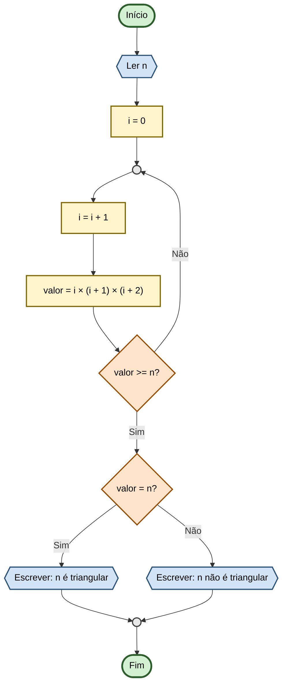

# Capítulo 3 - Exercício 23: Número Triangular

> **Livro:** Algoritmos E Lógica Da Programação  
> **Capítulo:** 3 - Algoritmos e a suas representações

---

## 📝 Enunciado

Um número inteiro é considerado **triangular** se este for o produto de três números inteiros consecutivos, como,
por exemplo, 120 = 4 × 5 × 6. Elabore um fluxograma e um algoritmo que, após ler um número n inteiro, verifiquem 
se ele é ou não triangular.

## 📊 Fluxograma

---

## 🔗 Links Relacionados

- [⬅️ Anterior: Cap03_Ex19](../Cap03_Ex19/flowchart.md)
- [📝 Código Java](Cap03_Ex23.java)
- [➡️ Próximo: Cap03_Ex24](../Cap03_Ex24/flowchart.md)
- [📚 Resumo do Capítulo 3](../../../../docs/resumos/furlan-logica.md#capítulo-3)
