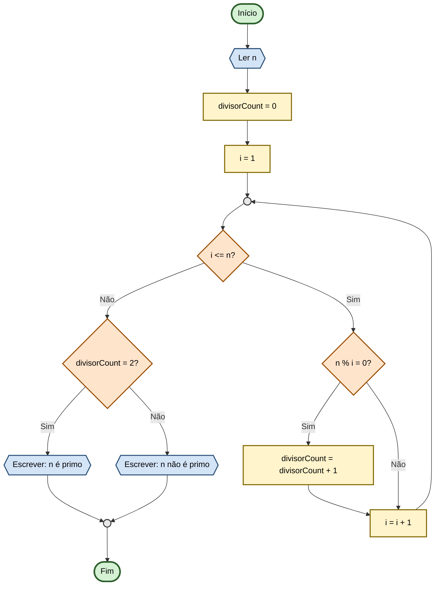

# Capítulo 3 - Exercício 24: Verificação de Número Primo

> **Livro:** Algoritmos E Lógica Da Programação  
> **Capítulo:** 3 - Algoritmos e Suas Representações

---

## 📝 Enunciado
Elabore um fluxograma e uma algoritmo que leia um valor n inteiro e verifique se este é ou não primo (numéro primo 
é aquele que é divisível apenas por 1 e por ele mesmo).

---

## 📊 Fluxograma

---

## 🔗 Links Relacionados

- [⬅️ Anterior: Cap03_Ex23](../Cap03_Ex23/flowchart.md)
- [📝 Código Java](Cap03_Ex24.java)
- [➡️ Próximo: Cap03_Ex25](../Cap03_Ex25/flowchart.md)
- [📚 Resumo do Capítulo 3](../../../../docs/resumos/furlan-logica.md#capítulo-3)
