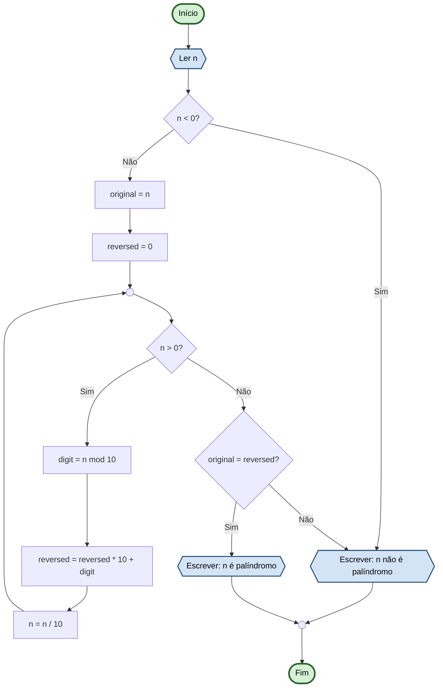

# Capítulo 3 - Exercício 25: Verificação de Número Palíndromo

> **Livro:** Algoritmos E Lógica Da Programação  
> **Capítulo:** 3 - Algoritmos e Suas Representações

---

## 📝 Enunciado

Um número palíndromo é aquele que se lido da esquerda para a direita e da direita para a esquerda possui o mesmo valor (ex: 34543). Elabore um fluxograma que leia um número n, inteiro, e verifique se ele é um palíndromo.

---

## 📊 Fluxograma

---

## 🔗 Links Relacionados

- [⬅️ Anterior: Cap03_Ex24](../Cap03_Ex24/flowchart.md)
- [📝 Código Java](Cap03_Ex25.java)
- [➡️ Próximo: Cap03_Ex26](../Cap03_Ex26/flowchart.md)
- [📚 Resumo do Capítulo 3](../../../../docs/resumos/furlan-logica.md#capítulo-3)
