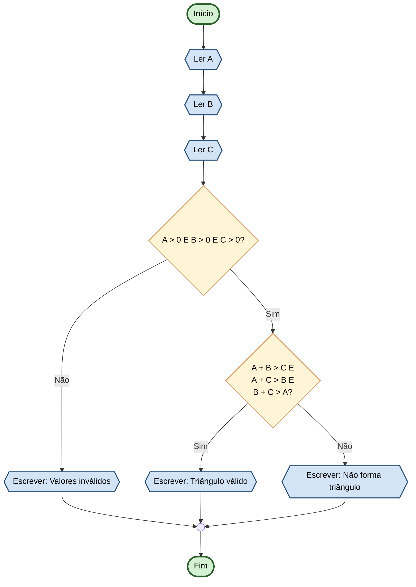

# Capítulo 3 - Exercício 26: Verificação de Triângulo Válido

> **Livro:** Algoritmos E Lógica Da Programação  
> **Capítulo:** 3 - Algoritmos e Suas Representações

---

## 📝 Enunciado

Elabore um fluxograma que receba três valores digitados A, B e C, informando se estes podem ser os lados de um
triângulo.

---

## 📊 Fluxograma

---

## 🔗 Links Relacionados

- [⬅️ Anterior: Cap03_Ex25](../Cap03_Ex25/flowchart.md)
- [📝 Código Java](Cap03_Ex26.java)
- [➡️ Próximo: Cap03_Ex30](../Cap03_Ex30/flowchart.md)
- [📚 Resumo do Capítulo 3](../../../../docs/resumos/furlan-logica.md#capítulo-3)
