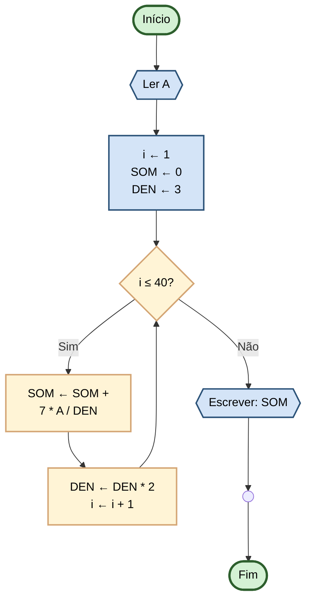

# Capítulo 3 - Exercício 30: Soma de Série (40 Termos)

> **Livro:** Algoritmos E Lógica Da Programação  
> **Capítulo:** 3 - Algoritmos e Suas Representações

---

## 📝 Enunciado

Elabore um fluxograma que represente o algoritmo para calcular a soma dos primeiros 40 termos da sequência definida a
seguir,
com o valor de A fornecido via teclado.

$$\frac{7 * A}{3}, \frac{7 * A}{6}, \frac{7 * A}{12}, \frac{7 * A}{24}, \frac{7 * A}{48}, ...$$

---

## 📊 Fluxograma

---

## 🧠 Observação

### 1. Estrutura da Sequência

O **numerador** é constante: $7A$

O **denominador** dobra a cada termo: $3, 6, 12, 24, 48, ...$

Isso forma: $3 \cdot 2^{n-1}$

---

### 2. Fórmula do Termo Geral

O termo na posição $n$ é:

$$T_n = \frac{7A}{3 \cdot 2^{n-1}}$$

Ou na forma de Progressão Geométrica (PG):

$$T_n = \frac{7A}{3} \cdot \left(\frac{1}{2}\right)^{n-1}$$

---

### 3. Razão da Progressão

Cada termo é metade do anterior:

$$r = \frac{1}{2}$$

---

### 4. Soma dos Primeiros n Termos de uma PG

Fórmula geral:

$$S_n = a_1 \cdot \frac{1 - r^n}{1 - r}$$

Onde:

- $S_n$ = Soma dos n primeiros termos
- $a_1$ = Primeiro termo
- $r$ = Razão da progressão
- $n$ = Número de termos

---

### 5. Soma dos 40 Termos da Série

**Primeiro termo:**
$$a_1 = \frac{7A}{3}$$

**Razão:**
$$r = \frac{1}{2}$$

**Aplicando a fórmula:**

$$S_{40} = \frac{7A}{3} \cdot \frac{1 - \left(\frac{1}{2}\right)^{40}}{1 - \frac{1}{2}}$$

**Simplificando:**

$$S_{40} = \frac{7A}{3} \cdot \frac{1 - \left(\frac{1}{2}\right)^{40}}{\frac{1}{2}}$$

$$S_{40} = \frac{14A}{3} \cdot \left(1 - \frac{1}{2^{40}}\right)$$

---

## 🔗 Links Relacionados

- [⬅️ Anterior: Cap03_Ex26](../Cap03_Ex26/flowchart.md)
- [📝 Código Java](Cap03_Ex30.java)
- [➡️ Próximo: Cap03_Ex40](../Cap03_Ex40/flowchart.md)
- [📚 Resumo do Capítulo 3](../../../../docs/resumos/furlan-logica.md#capítulo-3)
