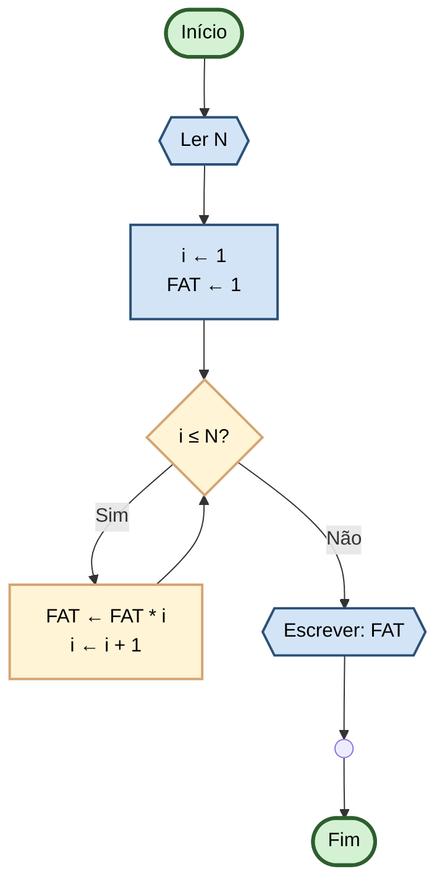

# Capítulo 3 - Exercício 40: Cálculo de Fatorial

> **Livro:** Algoritmos E Lógica Da Programação  
> **Capítulo:** 3 - Algoritmos e Suas Representações

---

## 📝 Enunciado

Elabore um fluxograma que, dado um valor n inteiro, calculará seu fatorial. (`n! = n * (n-1) * ... * 1`)

---

## 📊 Fluxograma

---

## 🔗 Links Relacionados

- [⬅️ Anterior: Cap03_Ex30](../Cap03_Ex30/flowchart.md)
- [📝 Código Java](Cap03_Ex40.java)
- [➡️ Próximo: Cap03_Ex44](../Cap03_Ex44/flowchart.md)
- [📚 Resumo do Capítulo 3](../../../../docs/resumos/furlan-logica.md#capítulo-3)
