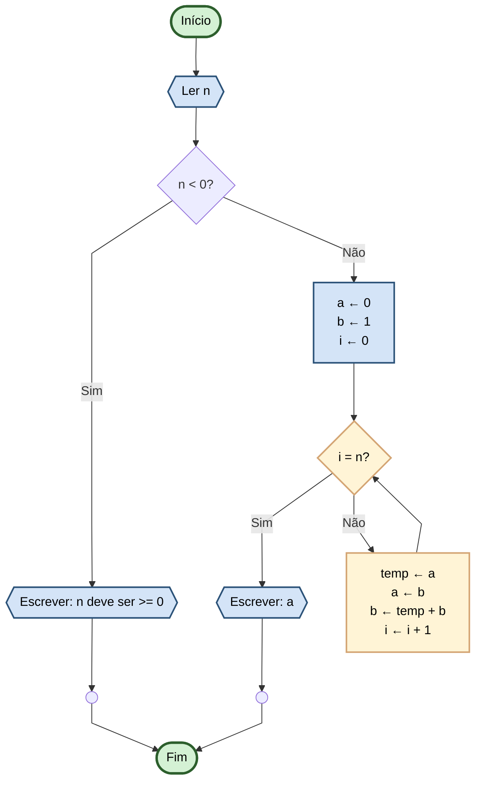

# Capítulo 3 - Exercício 44: N-ésimo Termo de Fibonacci

> **Livro:** Algoritmos E Lógica Da Programação  
> **Capítulo:** 3 - Algoritmos e suas Representações

---

## 📝 Enunciado

Um número da séria de Fibonacci é gerado a partir da soma dos dois números anteriores. Convenciona-se que o primeiro, é
$f_0 = 0$, e o segundo, $f_1 = 1$. A partir desse valor é possível calcular o n-ésimo elemento da série assim (para n>
2):

$$f(n) = f_{n-1} + f_{n-2}$$

---

## 📊 Fluxograma

---

## 🔗 Links Relacionados

- [⬅️ Anterior: Cap03_Ex40](../Cap03_Ex40/flowchart.md)
- [📝 Código Java](Cap03_Ex44.java)
- [➡️ Próximo: Cap03_Ex47](../Cap03_Ex47/flowchart.md)
- [📚 Resumo do Capítulo 3](../../../../docs/resumos/furlan-logica.md#capítulo-3)
