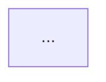

# Exercícios de Lógica - Furlan

Exercícios do livro "Algoritmos e Lógica da Programação" resolvidos em **pseudocódigo** e **diagramas Mermaid**.

**📖 Livro:** Algoritmos e Lógica da Programação  
**✍️ Autores:** André Villar Forbellone & Henri Frederico Eberspächer  
**📚 Ver resumo:** [docs/resumos/furlan-logica.md](../../../../docs/resumos/furlan-logica.md)

---

## 📋 Exercícios por Capítulo

### Capítulo 1: Introdução ⬜

| #   | Arquivo                        | Descrição | Conceitos | Status |
| --- | ------------------------------ | --------- | --------- | ------ |
| 1   | [Cap01_Ex01.md](Cap01_Ex01.md) |           |           | ⬜     |

### Capítulo 2: Conceitos de Computação e Computadores ⬜

_Exercícios serão adicionados conforme o estudo avançar_

### Capítulo 3: Algoritmos e Suas Representações ⬜

_Exercícios serão adicionados conforme o estudo avançar_

### Capítulo 4: Estruturas de Programação ⬜

_Exercícios serão adicionados conforme o estudo avançar_

### Capítulo 5: Variáveis Indexadas ⬜

_Exercícios serão adicionados conforme o estudo avançar_

### Capítulo 6: Técnicas para a Solução de Problemas ⬜

_Exercícios serão adicionados conforme o estudo avançar_

---

## 🎨 Padrão de Formatação

Cada exercício segue este formato:

````markdown
# Capítulo X - Exercício Y: Título do Exercício

&gt; **Livro:** Lógica de Programação - Furlan et al.
&gt; **Capítulo:** X - Nome do Capítulo
&gt; **Página:** YY

## 📝 Enunciado

[texto original do livro]

## 💭 Análise do Problema

**Entrada:** ...
**Processamento:** ...
**Saída:** ...

## 📊 Fluxograma (Mermaid)


````

## 📝 Pseudocódigo

```
ALGORITMO Nome
...
```

## 🧪 Teste de Mesa

| ... | ... |

## 🎯 Conceitos Aplicados

- Conceito 1
- Conceito 2

## 💡 Observações

[insights pessoais]

**Status:** ✅/⬜ | **Data:** DD/MM/AAAA

```

---

## 🔍 Legenda de Status

- ✅ Resolvido e documentado
- 🔄 Em andamento
- ⬜ Não iniciado
- 🐛 Com erro/revisão pendente

---

## 📚 Material Relacionado

- [Resumo do livro](../../../../docs/resumos/furlan-logica.md)
- [Roadmap - Parte 1](../../../../ROADMAP.md#parte-1)
- [Exercícios Java](../../fundamentals/)

---

**[⬅️ Voltar](../)**
```
