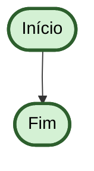
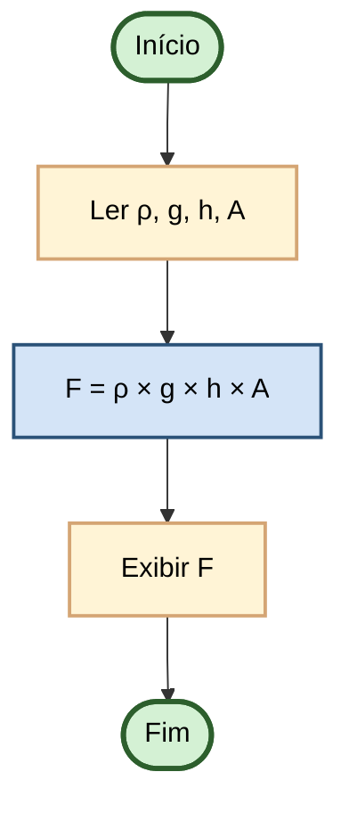
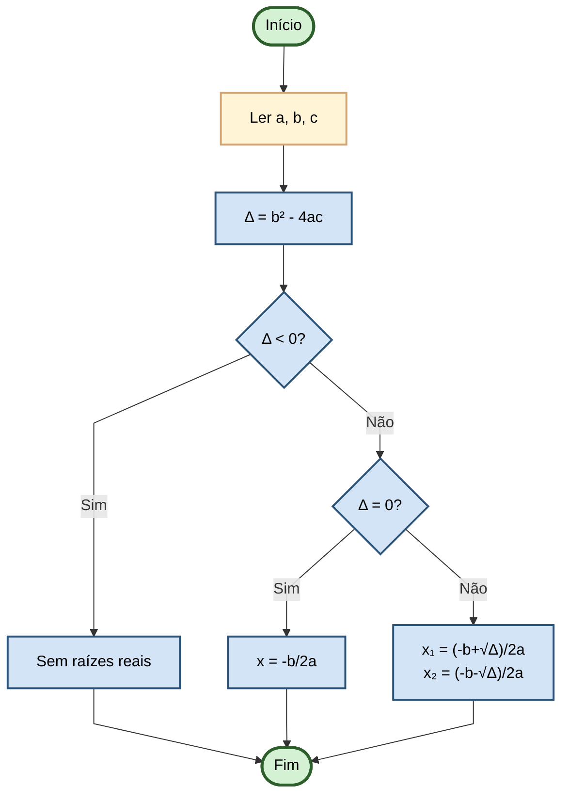
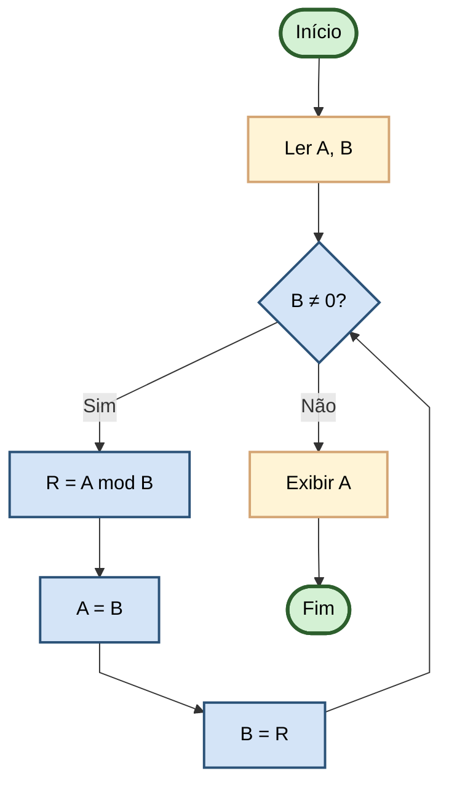

# Algoritmos E Lógica Da Programação.

> Resumo e anotações do livro "Algoritmos e Lógica da Programação"

**Autores:** Marco A. Furlan de Souza.

**Status:** 🔄 Iniciado.

**Parte do:** [Roadmap - Parte 1](../../ROADMAP.md#parte-1-fundação---lógica-algoritmos-e-computação-)

---

## 📑 Índice de Capítulos

- [Capítulo 1: Introdução](#capítulo-1-introdução)
- [Capítulo 2: Conceitos de Computação e Computadores](#capítulo-2-conceitos-de-computação-e-computadores)
- [Capítulo 3: Algoritmos e Suas Representações](#capítulo-3-algoritmos-e-suas-representações)
- [Capítulo 4: Estruturas de Programação](#capítulo-4-estruturas-de-programação)
- [Capítulo 5: Variáveis Indexadas](#capítulo-5-variáveis-indexadas)
- [Capítulo 6: Técnicas para a Solução de Problemas](#capítulo-6-técnicas-para-a-solução-de-problemas)

---

## Capítulo 1: Introdução

### 📝 Resumo

Este capítulo apresenta os fundamentos do desenvolvimento de software, explicando a diferença entre dados e informação, as etapas do processo de engenharia de software, e introduz o conceito de algoritmos como base para a programação estruturada.

### 💡 Pontos Importantes

#### 🖥️ Sobre Programação

- Um programa de computador é produto da atividade intelectual de um programador
- Depende de treinamento prévio em **abstração** e **modelagem de problemas**
- Exige uso da lógica na verificação das soluções

#### 📊 Dados vs Informação

| Conceito             | Definição                                                        |
| -------------------- | ---------------------------------------------------------------- |
| **Dado**             | Valor qualquer armazenado em um computador (bruto, sem contexto) |
| **Informação**       | Interpretação do dado com significado                            |
| **Dados de Entrada** | Fornecidos pelo usuário ao sistema                               |
| **Dados de Saída**   | Fornecidos pelo sistema ao usuário após processamento            |

#### 🔄 Etapas do Desenvolvimento de Software

1. **Análise**

   - Criação de especificações detalhando como o software vai funcionar
   - Define requisitos e funcionalidades

2. **Projeto**

   - Transforma especificações da análise em termos mais próximos da implementação
   - Arquitetura e design do sistema

3. **Implementação**

   - Utiliza linguagem de programação para construir o software
   - Traduz especificações do projeto em código

4. **Teste**
   - Verifica conformidade com requisitos iniciais
   - Software deve satisfazer todas as especificações

### 🎯 Conceitos-Chave

- **Abstração:** Capacidade de simplificar problemas complexos focando no essencial.
- **Modelagem:** Representação estruturada de um problema real.
- **Algoritmo:** Sequência lógica e finita de passos para resolver um problema.
- **Estruturas de Programação:** Blocos fundamentais que compõem qualquer algoritmo.
- **Processo de Engenharia de Software:** Metodologia sistemática para desenvolvimento.

### 📚 Exercícios Relacionados

- [Exercícios do Capítulo 1](../../challenges/src/algorithms/furlan/README.md)

---

## Capítulo 2: Conceitos de Computação e Computadores

### 📝 Resumo

Este capítulo explora a evolução histórica dos computadores através de suas gerações, desde dispositivos mecânicos até os modernos chips VLSI. Apresenta a etimologia da computação, os fundamentos da eletrônica digital, e explica como os computadores representam e processam diferentes tipos de dados através de sua arquitetura.

### 💡 Pontos Importantes

#### 📖 Etimologia e Fundamentos

- **Digitus (Latim)** → Dedo → Dígito (Português)
  - Reflete a origem da contagem usando os dedos
- **Computação** = Ato ou efeito de computar
  - Essencialmente significa "fazer contagem"

#### 🕰️ Evolução das Gerações de Computadores

##### **Geração Zero (~Até 1940) - Computadores Puramente Mecânicos**

- Dispositivos baseados em engrenagens, alavancas e componentes mecânicos
- **Destaques:**
  - Ábaco (antiguidade)
  - Pascaline (1642) - Blaise Pascal
  - Máquina Analítica de Babbage (1837)
- **Características:** Lentos, limitados, sem eletrônica

##### **Primeira Geração (1940-1956) - Válvulas e Relés**

- Primeiros computadores **eletrônicos**
- **Destaques:**
  - ENIAC (1946) - Electronic Numerical Integrator and Computer
  - UNIVAC (1951) - Primeiro computador comercial
- **Características:**
  - Enormes dimensões (salas inteiras)
  - Alto consumo de energia
  - Aquecimento excessivo
  - Frequentes falhas nas válvulas
  - Programação em linguagem de máquina

##### **Segunda Geração (1956-1963) - Transistores**

- Substituição das válvulas por **transistores**
- **Destaques:**
  - IBM 7090 (1959)
  - Surgimento de linguagens de alto nível (FORTRAN, COBOL)
- **Características:**
  - Menor tamanho e consumo energético
  - Maior confiabilidade
  - Mais rápidos e eficientes
  - Menor geração de calor

##### **Terceira Geração (1964-1971) - Circuitos Integrados**

- Introdução dos **CIs (Circuitos Integrados)**
- **Destaques:**
  - IBM System/360 (1964)
  - Múltiplos transistores em um único chip
- **Características:**
  - Miniaturização significativa
  - Maior velocidade de processamento
  - Redução de custos de produção
  - Início da popularização dos computadores

##### **Quarta Geração (1971-Presente) - Chips VLSI**

- **VLSI:** Very Large Scale Integration
- **Destaques:**
  - Intel 4004 (1971) - Primeiro microprocessador
  - Apple II (1977), IBM PC (1981)
  - Era dos computadores pessoais
  - Smartphones e dispositivos móveis
- **Características:**
  - Milhões/bilhões de transistores por chip
  - Computação pessoal e portátil
  - Processamento massivamente paralelo
  - Integração de múltiplas funções

---

#### 💻 Eletrônica Digital e Representação de Dados

| Conceito                  | Descrição                                                     |
| ------------------------- | ------------------------------------------------------------- |
| **Bit**                   | Unidade básica: 0 ou 1 (sistema binário)                      |
| **Múltiplos**             | Byte (8 bits), KB, MB, GB, TB, PB                             |
| **Caracteres**            | Representação de letras e símbolos (ASCII, Unicode)           |
| **Cadeias de Caracteres** | Sequências de caracteres (strings/texto)                      |
| **Som**                   | Digitalização de ondas sonoras em valores binários            |
| **Imagem**                | Representação de pixels com valores de cor em formato digital |

---

#### 🏗️ Arquitetura e Funcionamento

##### **Arquitetura de um Computador**

- **UCP (Unidade Central de Processamento):** Cérebro do computador
- **Memória:** Armazenamento de dados e instruções
- **Dispositivos de E/S:** Entrada e Saída de dados
- **Barramento:** Sistema de comunicação entre componentes

##### **Funcionamento da UCP na Execução de Programas**

1. **Busca (Fetch):** Busca a próxima instrução na memória
2. **Decodificação (Decode):** Interpreta o que a instrução significa
3. **Execução (Execute):** Realiza a operação especificada
4. **Armazenamento:** Guarda o resultado (se necessário)

---

### 🎯 Conceitos-Chave

- **Sistema Binário:** Base da computação digital (0 e 1).
- **Transistor:** Componente semicondutor que revolucionou a computação.
- **Circuito Integrado:** Chip que contém múltiplos componentes eletrônicos.
- **VLSI:** Integração em larga escala permitindo chips com bilhões de transistores.
- **UCP/CPU:** Responsável pelo processamento e execução de instruções.
- **Digitalização:** Conversão de informações analógicas (som, imagem) para formato binário.

---

## Capítulo 3: Algoritmos e Suas Representações

### 📝 Resumo

Este capítulo aborda o conceito de algoritmos, suas propriedades fundamentais, aplicações práticas tanto no contexto computacional quanto não-computacional, e as diferentes formas de representação de algoritmos utilizadas na programação estruturada.

### 💡 Pontos Importantes

#### 🎯 Aplicabilidades dos Algoritmos

> **"Algoritmos não servem apenas para programar computadores! São de uso geral!"**

Algoritmos estão presentes em toda tarefa do cotidiano: comer, respirar, dirigir, estudar, cozinhar, etc. Existem também algoritmos específicos para tarefas em Engenharia e Computação que requerem conhecimento especializado.

##### **Algoritmo Não-Computacional: Fazer Sorvete de Chocolate**

Um exemplo concreto de algoritmo fora do ambiente computacional é a receita para preparar um sorvete de chocolate.

**Ingredientes:**

- 1 tablete de chocolate meio amargo
- 1 lata de leite condensado
- A mesma medida da lata com leite
- Raspas de chocolate ou chocolate granulado

Com esses ingredientes, especificam-se os passos da receita conforme o algoritmo abaixo:

**Algoritmo 3.1 - Algoritmo para fazer um sorvete de chocolate**

**Início**
1. Ponha o chocolate em uma tigela refratária.
2. Deixe a tigela no micro-ondas durante um minuto em potência média.
3. Tire o chocolate do forno com cuidado e mexa-o até esfriar.
4. Bata-o no liquidificador com o leite condensado e o leite.
5. Despeje tudo em uma forma de gelo e espere congelar por três horas.
6. Distribua o sorvete em taças.
7. Decore com as raspas ou com o chocolate granulado.
8. Sirva.

**Fim**

---

##### **Algoritmo Computacional: Cálculo do Máximo Divisor Comum (MDC) - Euclides**

Outro exemplo é o algoritmo de Euclides para determinar o máximo divisor comum entre dois números inteiros x e y (valores de entrada).

**Algoritmo 3.2 - Algoritmo para calcular o máximo divisor comum entre dois números**

**Início**
1. Pedir para o usuário fornecer valores inteiros para x e y.
2. Enquanto y ≠ 0 Faça
   - r ← o resto da divisão entre x e y
   - x ← y
   - y ← r
3. Fim Enquanto
4. Exibir para o usuário o MDC procurado (em x).

**Fim**
---

#### 🔑 Propriedades dos Algoritmos

Todo algoritmo possui uma série de propriedades fundamentais. Segundo Furlan, essas propriedades devem ser observadas:

| Propriedade | Definição e Exemplo |
| ------------------- | ---------------------------------------------------------------------------------------------- |
| **Valores de Entrada** | Todo algoritmo deve possuir **zero, uma ou mais entradas de dados**. O algoritmo do sorvete representa um algoritmo com **zero entradas**, pois opera com quantidades fixas de ingredientes. O algoritmo de Euclides possui **duas entradas**: os valores inteiros x e y para o cálculo do máximo divisor comum. |
| **Valores de Saída** | Todo algoritmo possui **uma ou mais saídas**, que simboliza(m) seu(s) resultado(s). O algoritmo do sorvete tem como saída o **próprio sorvete pronto**. O algoritmo de Euclides tem como saída o **valor do máximo divisor comum entre x e y**. |
| **Finitude** | Todo algoritmo deve ser **finito**, isto é, deve possuir um **início e um conjunto de passos que, ao serem executados, levarão sempre ao seu término**. Ambos os exemplos (sorvete e Euclides) são finitos, pois chegam a um resultado em um número finito de passos. **Atenção:** Um algoritmo mal elaborado pode se tornar infinito. Por exemplo, no Algoritmo 3.2, se a condição for alterada para y ≥ 0, o algoritmo nunca chegará ao fim. |
| **Passos Elementares** | Um algoritmo computacional deve ser **explicitado por meio de operações elementares**, sem ambiguidades, de forma que possa ser executado por máquinas. O algoritmo de Euclides usa apenas **operações matemáticas simples** (divisão, resto, atribuição) e **comparações**, que qualquer computador realiza naturalmente. O algoritmo do sorvete precisa ser bem-refinado para ter suas operações em passos elementares. |
| **Correção** | Um algoritmo deve ser **correto**, isto é, deve permitir que com sua execução se chegue às saída(s) com **resultados coerentes com a(s) entrada(s)**. Para validar: teste com diversos valores de entrada já conhecidos. Exemplo: o MDC de 12 e 9 é 3. Execute o Algoritmo 3.2 com x=12 e y=9 para verificar o resultado. Teste com outros pares de valores para garantir a correção. |

---

#### 📊 Tipos de Representação de Algoritmos

Existem três principais formas de representar algoritmos:

1. **Diagrama de Blocos (Fluxograma)** ✓ (Usado no livro)
2. **Português Estruturado (Portugol)** ✓ (Usado no livro)
3. **Nassi-Shneiderman** (Técnica alternativa)

---

### 📐 Fluxograma (Diagrama de Blocos)

#### 🔍 Características

- Utiliza **símbolos gráficos específicos** para representar operações
- Expressões podem ser escritas no interior dos símbolos
- Permite uso de sub-rotinas nas expressões
- Padronizado pela **Norma ISO 5807 (1985)**

#### 📋 Símbolos de Fluxograma (Norma ISO 5807)

| Ícone / Forma | ASCII | Nome | Resumo da Utilidade |
| :---: | :---: | :--- | :--- |
| ⬭ | `( )` | **Terminador** | Indica o **início** ou o **fim** de um programa, ou a conexão com o ambiente externo. |
| ▭ | `[ ]` | **Processo** | Representa uma **ação, cálculo ou processamento** que altera o estado ou valor dos dados. |
| ➔ | `→` | **Linha Básica** | Indica a **direção do fluxo** de execução e a sequência dos passos. |
| ⌨️ | `\ /` | **Entrada Manual** | Representa a **inserção de dados pelo usuário** em tempo real (ex: digitar uma informação no teclado). |
| 🖥️ | `> ]` | **Exibição** | Mostra **resultados ou informações visuais** para o usuário (ex: exibir uma mensagem no monitor). |
| ◇ | `< >` | **Decisão** | Representa uma **condição ou teste lógico**. O fluxo toma caminhos diferentes dependendo do resultado (ex: Sim/Não). |

---

#### 1️⃣ Fluxograma Mínimo - Início e Fim



---

#### 2️⃣ Fluxograma de Comandos Sequenciais

**Problema:** Calcular a força exercida pela coluna de líquido na válvula de um reservatório

**Fórmula:** F = ρ × g × h × A



---

#### 3️⃣ Fluxograma de Comando de Decisão

**Problema:** Resolver equação de segundo grau (ax² + bx + c = 0)



---

#### 4️⃣ Fluxograma de Comando de Repetição

**Problema:** Calcular o Máximo Divisor Comum usando Algoritmo de Euclides



---

### 💻 Português Estruturado (Portugol)

Português estruturado é uma forma de representação de algoritmos mais próxima da linguagem humana, utilizando palavras reservadas em português. O **Portugol Studio** (base do Portugol.dev) utiliza sintaxe semelhante a C/Java.

#### 📐 Estrutura Básica

```portugol
programa {
    funcao inicio() {
        // Declaração de variáveis
        real A, B, F
        cadeia nome
        
        // Leitura de dados
        leia(A, B)
        
        // Processamento
        F = A * B
        
        // Saída de dados
        escreva(F)
    }
}
```

#### 📌 Exemplo: Calcular Força no Reservatório

```portugol
programa {
    funcao inicio() {
        real densidade, gravidade, altura, area, forca
        
        escreva("Digite a densidade: ")
        leia(densidade)
        escreva("Digite a gravidade: ")
        leia(gravidade)
        escreva("Digite a altura: ")
        leia(altura)
        escreva("Digite a área: ")
        leia(area)
        
        forca = densidade * gravidade * altura * area
        
        escreva("Força exercida: ", forca, " N\n")
    }
}
```

#### 📌 Exemplo: Equação de Segundo Grau

```portugol
programa {
    inclua biblioteca Matematica --> mat
    
    funcao inicio() {
        real a, b, c, delta, x1, x2
        
        escreva("Digite o coeficiente a: ")
        leia(a)
        escreva("Digite o coeficiente b: ")
        leia(b)
        escreva("Digite o coeficiente c: ")
        leia(c)
        
        delta = (b * b) - (4 * a * c)
        
        se (delta < 0) {
            escreva("Sem raízes reais\n")
        } senao {
            se (delta == 0) {
                x1 = -b / (2 * a)
                escreva("Raiz: ", x1, "\n")
            } senao {
                x1 = (-b + mat.raiz(delta)) / (2 * a)
                x2 = (-b - mat.raiz(delta)) / (2 * a)
                escreva("Raiz 1: ", x1, "\n")
                escreva("Raiz 2: ", x2, "\n")
            }
        }
    }
}
```

#### 📌 Exemplo: MDC - Algoritmo de Euclides

```portugol
programa {
    funcao inicio() {
        inteiro a, b, resto
        
        escreva("Digite o primeiro número: ")
        leia(a)
        escreva("Digite o segundo número: ")
        leia(b)
        
        enquanto (b != 0) {
            resto = a % b
            a = b
            b = resto
        }
        
        escreva("MDC: ", a, "\n")
    }
}
```

**Referência:** [Portugol.dev](https://portugol.dev/) | [Portugol Studio](https://univali-lite.github.io/Portugol-Studio/)

---

### 🎨 Nassi-Shneiderman (Diagrama de Struktograma)

Representação alternativa de algoritmos utilizando estruturas retangulares aninhadas. É uma forma simples e visual de representar a lógica de um programa.

#### 📌 Exemplo Simples: Equação de Segundo Grau

```
┌─────────────────────────────────┐
│ Ler a, b, c                     │
├─────────────────────────────────┤
│ Δ = b² - 4ac                    │
├────────────────────┬────────────┤
│  Δ < 0?            │            │
├──────────┬─────────┤            │
│   Sim    │   Não   │            │
├──────────┼─────────┤            │
│ Sem      │ Δ = 0?  │            │
│ raízes   ├─────┬───┤            │
│          │ Sim │Não│            │
│          │x=-b/2a  │            │
│          │    │    │            │
│          │    │x₁,x₂ formulae   │
└──────────┴────┴────┴────────────┘
```

---

### 🔄 Conversão de Tipos

#### 1️⃣ Números

- **Inteiro para Real:** `5` → `5.0`
- **Real para Inteiro:** `5.7` → `5` (truncamento ou arredondamento)

#### 2️⃣ Caracteres e Cadeias de Caracteres

- **Número para Caractere:** `65` → `'A'` (tabela ASCII)
- **Caractere para Número:** `'5'` → `5`
- **Cadeia para Número:** `"123"` → `123`

#### 3️⃣ Valores Lógicos

- **Número para Booleano:** `0` → `falso`, qualquer outro → `verdadeiro`
- **Booleano para Número:** `verdadeiro` → `1`, `falso` → `0`

#### 4️⃣ Conversão para Nome de Variável

Regras para criar nomes de variáveis:
- Começar com letra ou underscore (_)
- Conter apenas letras, números e underscore
- Não podem ser palavras-chave da linguagem
- Devem ser descritivos

**Exemplos válidos:** `idade`, `data_nascimento`, `saldo_conta`, `_valor`

**Exemplos inválidos:** `123idade`, `data-nascimento`, `valor@`, `se` (palavra-chave)

---

### 📐 Conversão para Expressões

#### 1️⃣ Operadores de Atribuição

| Operador | Exemplo | Significado |
| -------- | ------- | ----------- |
| `←` ou `=` | `A ← 5` | Atribui o valor 5 à variável A |

#### 2️⃣ Operadores Aritméticos

| Operador | Símbolo | Exemplo | Resultado |
| -------- | ------- | ------- | --------- |
| Adição | `+` | `5 + 3` | `8` |
| Subtração | `-` | `5 - 3` | `2` |
| Multiplicação | `*` | `5 * 3` | `15` |
| Divisão | `/` | `6 / 2` | `3` |
| Resto (Módulo) | `mod` | `7 mod 3` | `1` |
| Potência | `^` ou `**` | `2 ^ 3` | `8` |

#### 3️⃣ Operadores Relacionais

| Operador | Símbolo | Exemplo | Resultado |
| -------- | ------- | ------- | --------- |
| Igual | `=` | `5 = 5` | `verdadeiro` |
| Diferente | `<>` ou `!=` | `5 <> 3` | `verdadeiro` |
| Maior | `>` | `5 > 3` | `verdadeiro` |
| Menor | `<` | `5 < 3` | `falso` |
| Maior ou igual | `≥` ou `>=` | `5 >= 5` | `verdadeiro` |
| Menor ou igual | `≤` ou `<=` | `3 <= 5` | `verdadeiro` |

#### 4️⃣ Operadores Lógicos

| Operador | Símbolo | Tabela Verdade |
| -------- | ------- | -------------- |
| **E (AND)** | `e` ou `&&` | `V e V = V` / `V e F = F` / `F e F = F` |
| **OU (OR)** | `ou` ou `\|\|` | `V ou V = V` / `V ou F = V` / `F ou F = F` |
| **NÃO (NOT)** | `nao` ou `!` | `não V = F` / `não F = V` |

#### 5️⃣ Expressões

Uma expressão é uma combinação de operadores e operandos que resulta em um valor.

**Exemplos:**
- `3 + 5 * 2` = `13` (multiplicação tem precedência)
- `(3 + 5) * 2` = `16` (parênteses mudam precedência)
- `idade > 18 e cpf <> ""` = resultado booleano
- `(A > B) ou (B < C) e (D = 0)` = combinação de operadores relacionais e lógicos

**Precedência de Operadores (do maior para o menor):**
1. Parênteses `()`
2. Potência `^`
3. Multiplicação, Divisão, Módulo `*, /, mod`
4. Adição, Subtração `+, -`
5. Operadores Relacionais `=, <>, >, <, >=, <=`
6. Operador `não`
7. Operador `e`
8. Operador `ou`

---

### 🛠️ Sub-rotinas Pré-definidas

#### 1️⃣ Funções Matemáticas

| Função | Sintaxe | Descrição |
| ------ | ------- | --------- |
| Raiz Quadrada | `RaizQua(x)` | Retorna a raiz quadrada de x |
| Valor Absoluto | `Abs(x)` | Retorna o valor absoluto de x |
| Seno | `Sen(x)` | Retorna o seno de x (em radianos) |
| Cosseno | `Cos(x)` | Retorna o cosseno de x |
| Tangente | `Tan(x)` | Retorna a tangente de x |
| Exponencial | `Exp(x)` | Retorna e elevado a x |
| Logaritmo Natural | `Ln(x)` | Retorna o logaritmo natural de x |
| Inteiro | `Int(x)` | Retorna a parte inteira de x |
| Arredonda | `Arred(x)` | Arredonda x para o inteiro mais próximo |
| Aleatório | `Rnd()` | Retorna um número aleatório entre 0 e 1 |

**Exemplos:**
```portugol
raiz ← RaizQua(16)        // raiz = 4
valor ← Abs(-10)          // valor = 10
seno_valor ← Sen(3.14159) // seno_valor ≈ 0
inteira ← Int(5.7)        // inteira = 5
```

#### 2️⃣ Funções e Procedimentos para Cadeias de Caracteres

| Função | Sintaxe | Descrição |
| ------ | ------- | --------- |
| Comprimento | `Comp(texto)` | Retorna o número de caracteres da cadeia |
| Maiúsculas | `Maiusc(texto)` | Converte texto para maiúsculas |
| Minúsculas | `Minusc(texto)` | Converte texto para minúsculas |
| Substring | `SubCad(texto, pos, tam)` | Extrai tam caracteres a partir de pos |
| Posição | `Pos(subcadeia, texto)` | Retorna a posição de subcadeia em texto |
| Concatenação | `Concat(text1, text2)` | Une duas cadeias |
| Inversão | `Inv(texto)` | Inverte a ordem dos caracteres |

**Exemplos:**
```portugol
tamanho ← Comp("Hello")           // tamanho = 5
maiusculo ← Maiusc("pedro")       // maiusculo = "PEDRO"
minusculo ← Minusc("JOÃO")        // minusculo = "joão"
parte ← SubCad("programação", 1, 4) // parte = "prog"
posicao ← Pos("log", "programação") // posicao = 4
juntado ← Concat("Hello", "World") // juntado = "HelloWorld"
invertido ← Inv("algoritmo")      // invertido = "omtiroglA"
```

---

### 🎯 Conceitos-Chave

- **Algoritmo:** Sequência finita e bem definida de passos para resolver um problema.
- **Fluxograma:** Representação gráfica de um algoritmo usando símbolos padronizados.
- **Portugol:** Linguagem pseudocódigo estruturada que aproxima o algoritmo de linguagens reais.
- **Propriedades:** Entrada, Saída, Finitude, Passos Elementares, Correção.
- **Operadores:** Ferramentas para realizar operações em dados (aritméticas, relacionais, lógicas).
- **Sub-rotinas:** Funções pré-definidas que executam tarefas comuns.

---

## Capítulo 4: Estruturas de Programação

_[Em breve]_

---

## Capítulo 5: Variáveis Indexadas

_[Em breve]_

---

## Capítulo 6: Técnicas para a Solução de Problemas

_[Em breve]_

---

## 📊 Progresso de Leitura

- [x] Capítulo 1: Introdução
- [x] Capítulo 2: Conceitos de Computação e Computadores
- [x] Capítulo 3: Algoritmos e Suas Representações
- [ ] Capítulo 4: Estruturas de Programação
- [ ] Capítulo 5: Variáveis Indexadas
- [ ] Capítulo 6: Técnicas para a Solução de Problemas

**Progresso:** 3/6 capítulos (50%) 🎯

---

## 🎯 Conclusão Geral

_[A ser preenchido ao terminar o livro]_

---

**[⬅️ Voltar aos Resumos](README.md)** | **[🏠 Voltar ao README](../../README.md)**